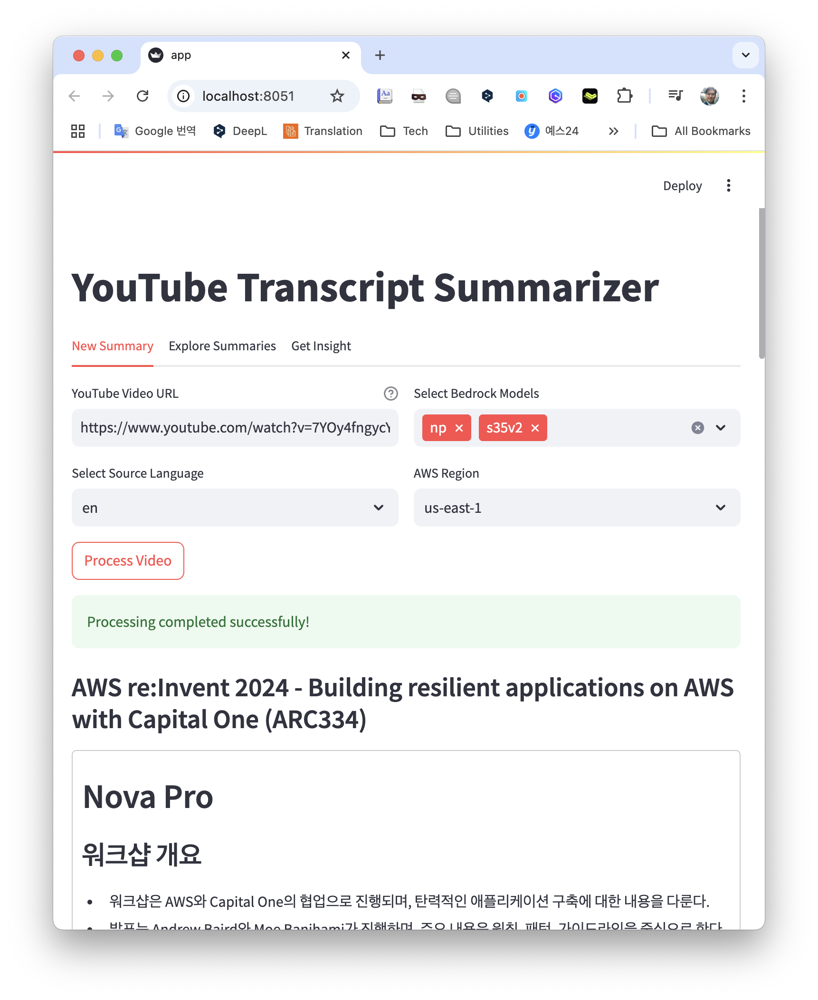
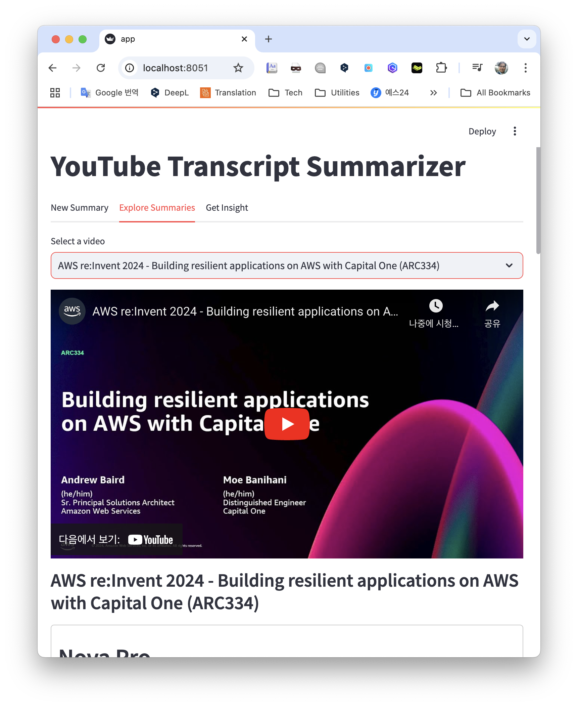
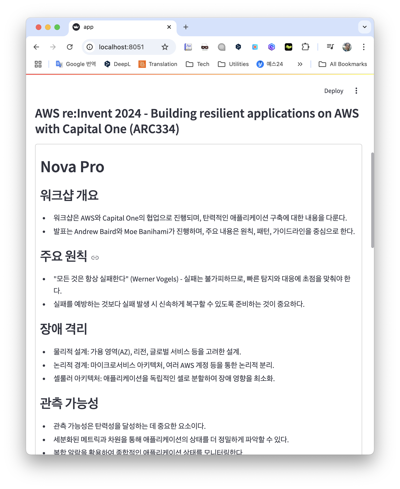
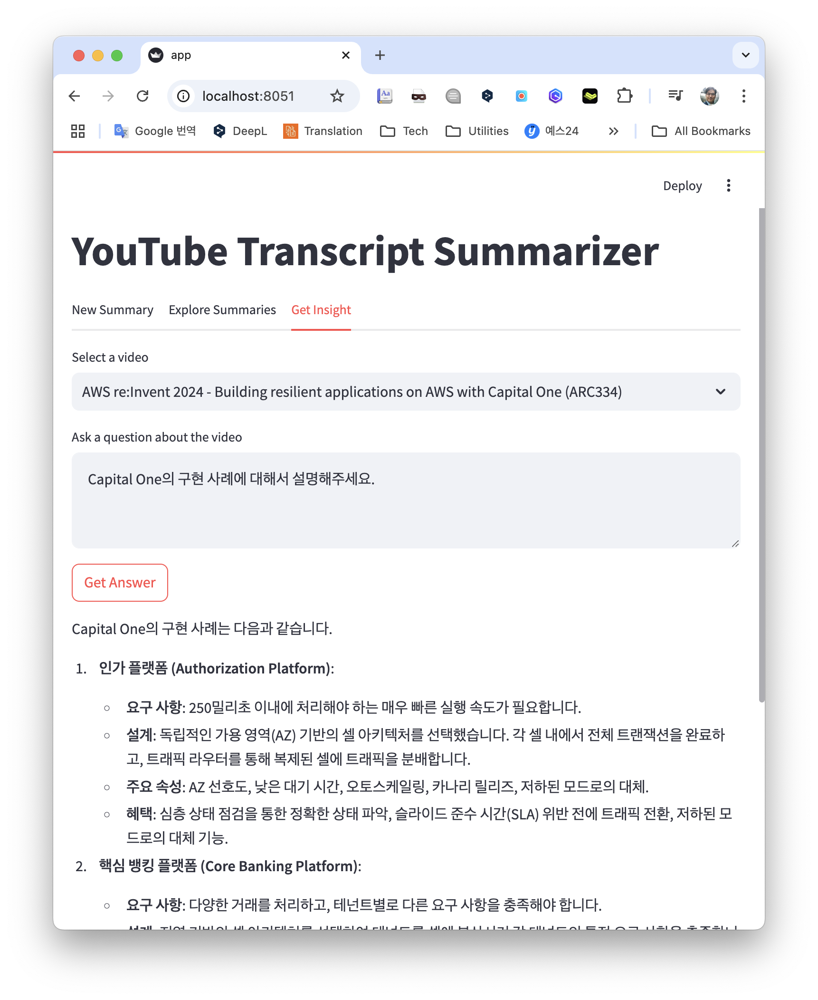

## Created by Dobal(dokeun@)

## 주요 기능
* Download video's transcripts
* Translate transcripts to other language using Amazon Translate
* Summarize transcripts using Amazon Bedrock

## 파이썬 가상환경
```shell
# 자막, 요약 결과 파일이 생성되는 폴더 생성
mkdir data

# 파이썬 가상환경, 처음 한 번만 실행
python -m venv venv

# 터미널에 (venv) 문구가 없을 때, 실행
source ./venv/bon/activate
```

## 필요 패키지 설치 (주의: 가상환경이 반드시 설정되어 있어야 함)
```shell
pip install -r requirements.txt
```

## 실행
```shell
streamlit run app.py --server.port=8051
```
* 모델 Alias : 콤마로 여러 개 설정 가능   
* Amazon Nova Pro : np  
* Amazon Nova Lite : nl
* Claude 3.5 Sonnet V2 : s35v2  
* Claude 3.5 Sonnet : s35  
* Claude 3.5 Haiku : h35

<table>
  <tr>
    <td></td>
    <td></td>
  </tr>
  <tr>
    <td></td>
    <td></td>
  </tr>
</table>

